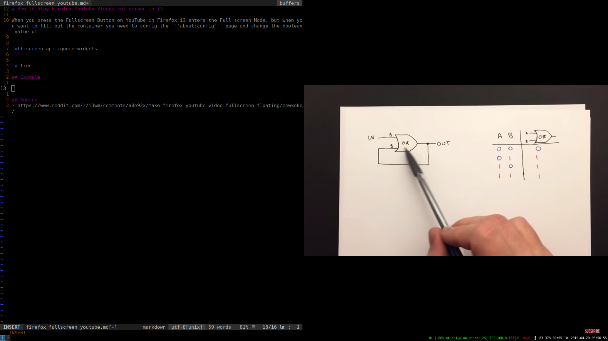
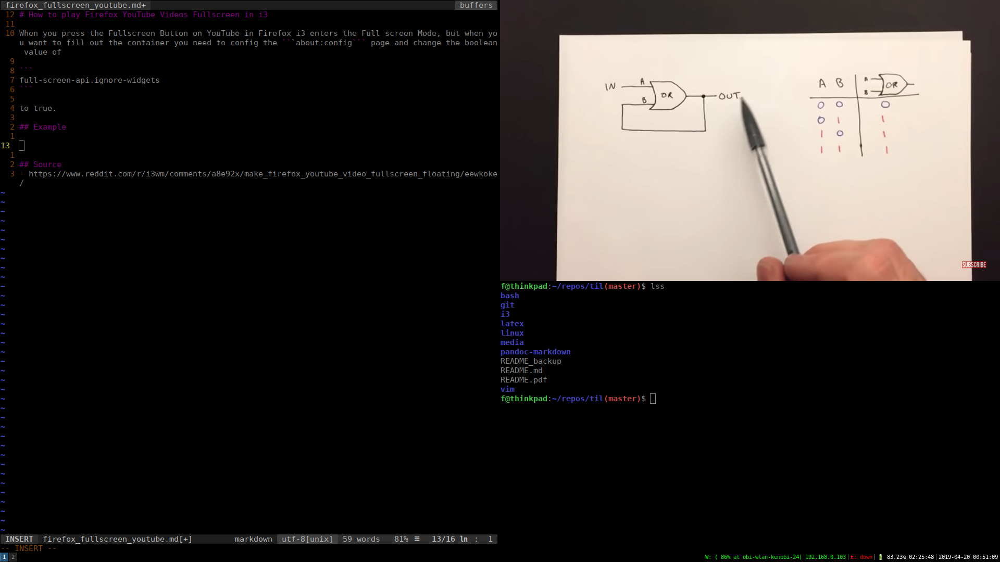

# How to play Firefox YouTube Videos Fullscreen in i3

When you press the Fullscreen Button on YouTube in Firefox i3 enters the Full screen Mode, but when you want to fill out the container you need to config the ```about:config``` page and change the boolean value of

```
full-screen-api.ignore-widgets
```

to true. 

## Example




## Source 
- https://www.reddit.com/r/i3wm/comments/a8e92x/make_firefox_youtube_video_fullscreen_floating/eewkoke/ 
