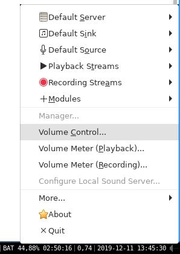

# How to control sound in i3

On my Ubuntu 18 machine where i replaced the gnome desktop enviroment with i3 my function keys stopped working. To quickly change audio values i use the tool `pasystray` and `pavucontrol` to create little symbol in the status bar for quick access.

You can install both with `apt`. To use it you have a instance of `pasystray` running in the background. To get that i just added one line to my i3 config

```bash
exec pasystray
```

## Extra

You can also use the tool `pavumeter` for a volume meter

## Pictures



## copy paste steps

1. `sudo apt install pasystray`
2. `sudo apt install pavucontrol`
3. add `exec pasystray` into your i3 config

## Sources

- https://www.reddit.com/r/i3wm/comments/4s0aev/how_to_add_volume_control_applet_to_status_bar/
