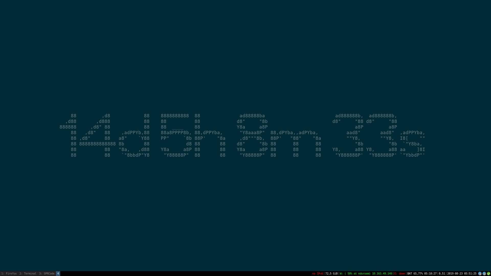

# Simple Countdown in the command line 

To create a simple countdown in the command line i use the tool ```termdown``` from this [github repository](https://github.com/trehn/termdown). 

# Example 

```termdown "2019-09-06 09:00 UTC"```


